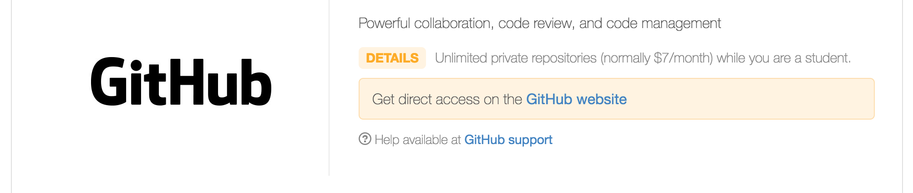
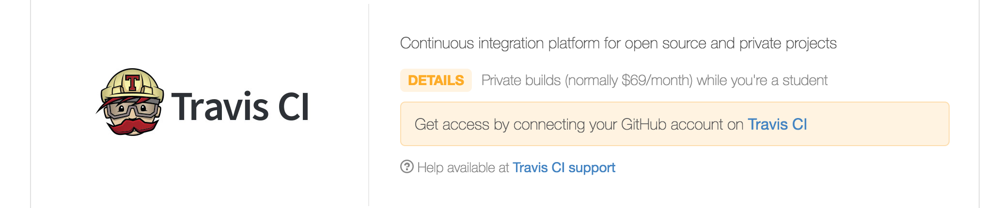

この記事は[OUCC アドベントカレンダー 2016](http://www.adventar.org/calendars/1389)の11日目の記事です。

昨日は[金糸雀(@kuhuida)](https://twitter.com/kuhuida)くんによる
[勉強と遊びのメリハリが大事](http://kanaria157.hatenablog.com/entry/2016/12/10/053055)でした。

明日は[ちゃにゃ(@tyanya7)](https://twitter.com/tyanya7)くんです。

# はじめに
随分と前の話になりますが、2016/05/11にこんなニュースがありました。

* [［速報］GitHub、月額7ドルでプライベートリポジトリを無制限に作成可能に。新料金プランを発表](http://www.publickey1.jp/blog/16/github7.html)
* [Introducing unlimited private repositories](https://github.com/blog/2164-introducing-unlimited-private-repositories)

[Student Developer Pack](https://education.github.com/pack/)でプライベートリポジトリを5個無料で使えていましたが、これによりプライベートリポジトリが無制限に作れるようになりました。

**Student Developer Pack**では様々なツール、プランが無料で提供されていて、その一つの[Travis CI](https://travis-ci.org/)ではプライベートリポジトリのビルドが行えるようになります。

せっかくなので両方使って何かしたいと思います。