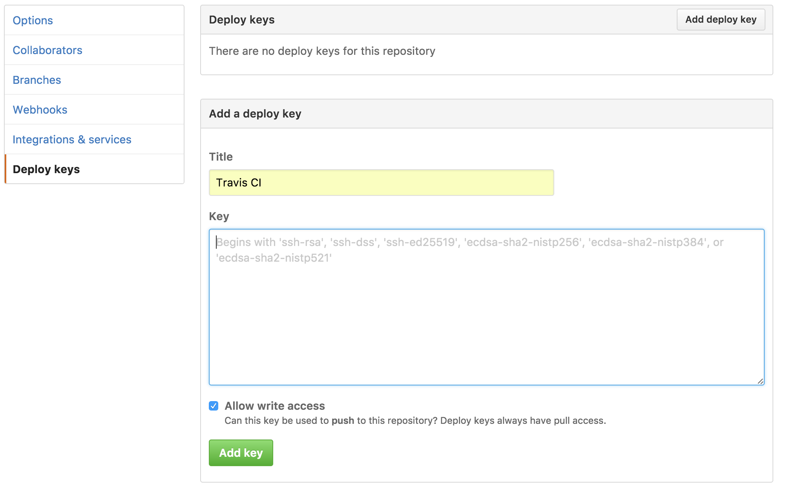
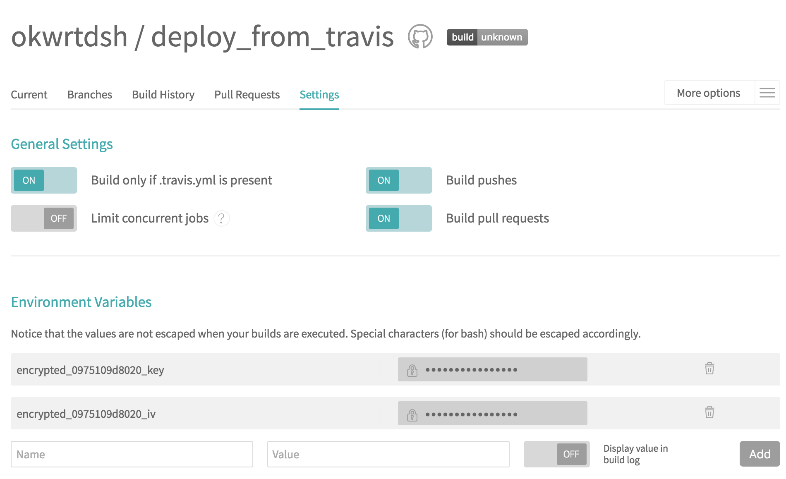
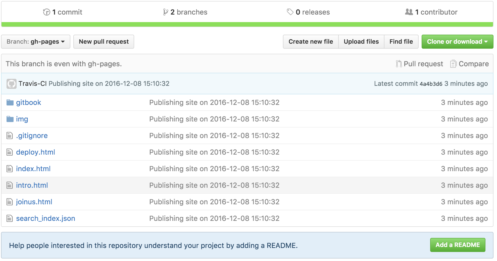

# Travis CIからgh-pagesにデプロイ
## 今回の目標
* Travis CIでビルドして、ビルドの成果物をgh-pagesにpushして公開

ドキュメントだったり、ビルドの成果物などなど、自ら生成して公開するのは面倒くさい。Travis CIを使えばそんな作業を自動化できます。今回はMarkdownで書かれたこの記事を[gitbook](https://github.com/GitbookIO/gitbook)でHTMLに変換して公開します。

## 1. Travis CIの設定
`https://travis-ci.org/profile/`(プライベートレポジトリの場合は`https://travis-ci.com/`)に行きスイッチをONにします。目的のレポジトリが表示されていない場合はSync accountのボタンを押してみて下さい。


## 2. GitHubにdeploy keyを登録
### 2.1 deploy_keyを生成

```sh
$ ssh-keygen -t rsa -b 4096 -C "example@example.com" -f deploy_key -N ''
Generating public/private rsa key pair.
Your identification has been saved in deploy_key.
Your public key has been saved in deploy_key.pub.
...
```

`https://github.com/<username>/<repository>/settings/keys`に行きdeploy keyを追加します。keyには先程生成した**deploy_key.pub**を入力します。`Allow write access`のチェックも忘れずに。



## 3. Travis CIにdeploy keyを登録
### 3.1 Travis CLIのインストール
[Travis CIのコマンドラインクライアント(CLI))](https://github.com/travis-ci/travis.rb)をインストールします。

```sh
$ gem install travis
```
### 3.2 Travis CLIでログイン

```sh
$ travis login
...
Username: username
Password for username: passward
Successfully logged in as username!
```

### 3.3 暗号化
2.1で生成したprivate keyを暗号化します。

```sh
$ travis encrypt-file deploy_key
Detected repository as <username>/<repository>, is this correct? |yes| yes
encrypting deploy_key for <username>/<repository>
storing result as deploy_key.enc
storing secure env variables for decryption

Please add the following to your build script (before_install stage in your .travis.yml, for instance):

    openssl aes-256-cbc -K $encrypted_0975109d8020_key -iv $encrypted_0975109d8020_iv -in deploy_key.enc -out deploy_key -d

Pro Tip: You can add it automatically by running with --add.

Make sure to add deploy_key.enc to the git repository.
Make sure not to add deploy_key to the git repository.
Commit all changes to your .travis.yml.
```

`deploy_key.enc`が生成され、`$encrypted_XXXXXXXXXXXX_key`と`$encrypted_XXXXXXXXXXXX_key`という環境変数がTravis CLIによってアップロードされます。
Settingsから複合に必要な環境変数が格納されているのを確認することができます。


### 3.4 削除
誤ってcommitしないようにここで`deploy_key`と`deploy_key.pub`は消しておきましょう。念のため`.gitignore`にも追加しておきましょう。

```sh
$ rm deploy_key deploy_key.pub
$ echo "deploy_key\ndeploy_key.pub" >> .gitignore
```

## 4. .travis.ymlの設定
### 4.1 復号化
3.3のログにあるように`.travis.yml`の`before_install`に`openssl aes-256...`を追加します。

```yml
before_install:
  - openssl aes-256-cbc -K $encrypted_0975109d8020_key -iv $encrypted_0975109d8020_iv -in deploy_key.enc -out deploy_key -d
```

### 4.2 ssh認証の有効化

`ssh-add`するときにpermissionがゆるいと怒られるのでchmodしてから追加します。
`Could not open a connection to your authentication agent.`と怒られるので`ssh-add`する前に`ssh-agent`を開始します。

```yml
# before_install続き
  - chmod 600 deploy_key
  - eval `ssh-agent -s`
  - ssh-add deploy_key
```
### 4.3 gitのアカウント設定

Travis CIでcommitするgitのアカウントを設定します。

```yml
# before_install続き
  - git config --global user.name "Travis-CI"
  - git config --global user.email "travis-ci@example.com"
```

### 4.4 node_jsの設定

gitbookでビルドするため`node_js`を使いました。

```yml
language: node_js
node_js:
  - '6.1'
sudo: false
cache:
  directories:
    - node_modules
```

### 4.5 ビルド、デプロイの設定
branchがmasterかつpull requestではない場合のみデプロイを行います。

```yml
script:
  - npm run build
  - '[ "$TRAVIS_BRANCH" == master ] && [ "$TRAVIS_PULL_REQUEST" == "false" ] && bash ./deploy.sh'
```

`npm run build`で`docs/`にHTMLが生成されるので、不要なものを削除して、commitして、gh-pagesにpushします。

```sh
#!/bin/bash -eu
cd docs
rm -f deploy_key deploy_key.enc deploy.sh .travis.yml package.json
git init
git add .
git commit -m "Publishing site on `date "+%Y-%m-%d %H:%M:%S"`"
git push -f git@github.com:okwrtdsh/deploy_from_travis.git master:gh-pages
```

## 5. masterにpush
masterにpushするとgh-pages branchが作成されます。


これで`https://<username>.github.io/<repository>/`に行くとgitbookが見られます。

# *完成!*

## まとめ
今回は見せるためにpublic repositoryで行いましたが、private repositoryでも同様に自動化できます。
private repositoryでもgithub.ioは公開されるので注意して下さい。

